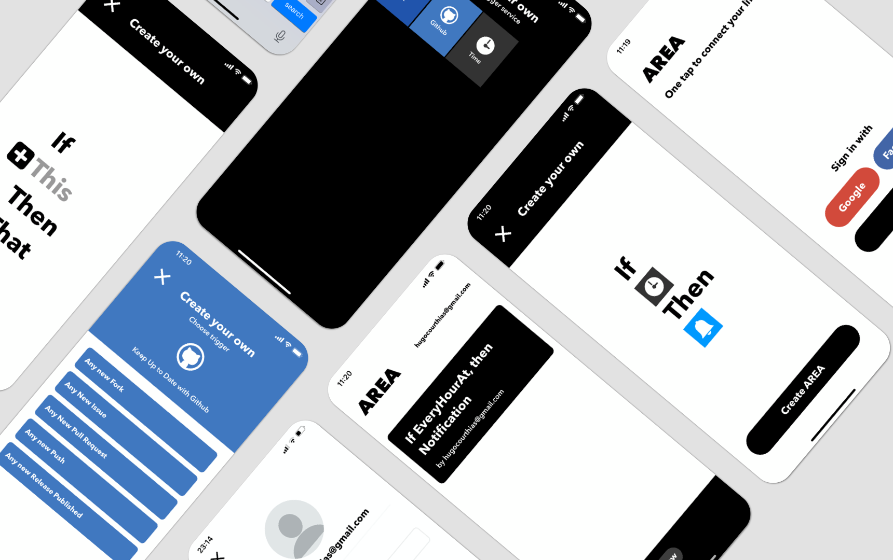

# Area 2020

## Description 🤓

The end goal of the project was to recreate IFTT. We, therefore, had to implement Actions and Reaction, or as we call them Areas.

## Building 🛠

To build the project locally, you will need docker, docker-compose, and you may also need Ngrok for webhooks.

You will first need to update the different Services API key with your own *src/config*. You then need to run Ngrok to create an HTTP tunnel on the Port 3000 (3000 is the default port we use, you may change it) and set the URL generated by Ngrok as redirect URL in the different Services you are using.

You may then run the docker-compose

## Deploying 🛫

The project is automatically deployed to a VPS instance by the Travis CI 🤖; you may also force a deploy by running *docker-compose.deploy.yml*

## Contributing 🤔

If you find a problem or want a new feature, you may create an issue on the projects [Github](https://github.com/ImOverlord/Area). Please use the correct issue templates 🙃.

## Documentation 🗂

### Back-End

You can find the Documentation for the different public endpoints in *server/API_DOC* (Download and use [Stoplight Studio](https://stoplight.io/studio/), so you do not have to read a YML file 😅).

# Self Hosting

You can fork and use this project for your own personel use, you will need to give your own credentials to the different services needed.

