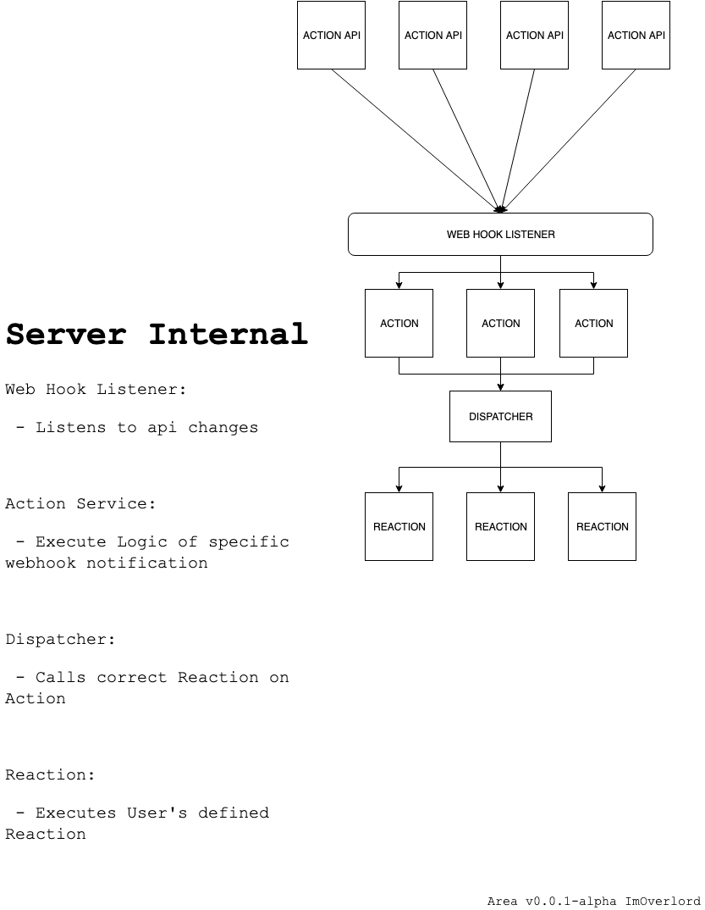
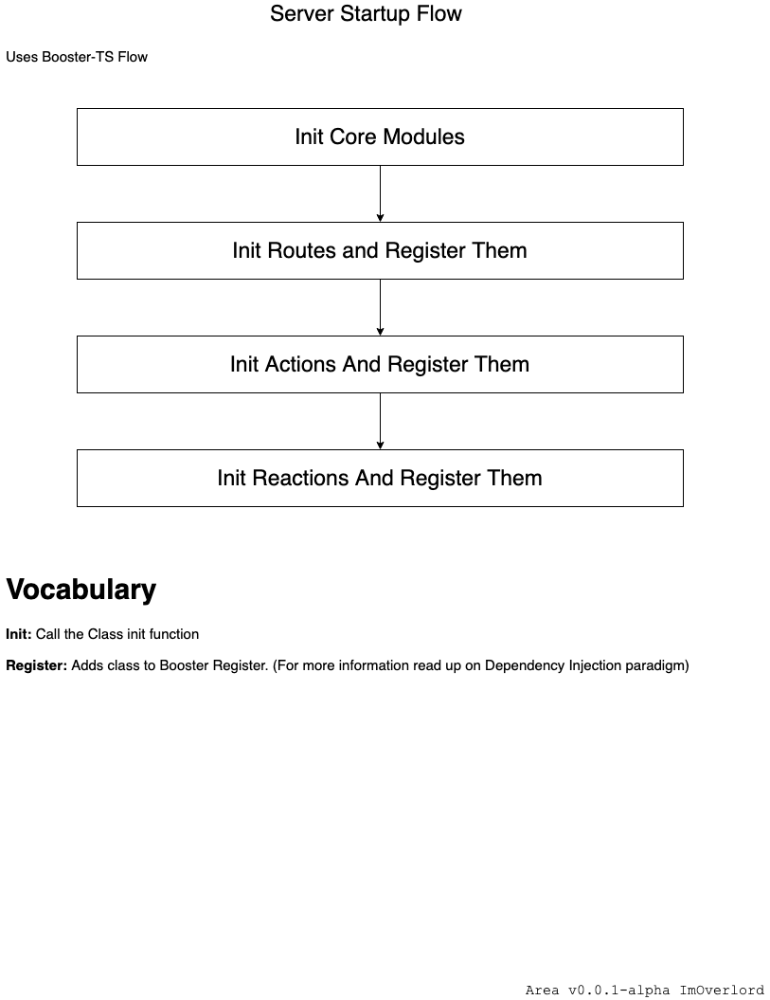

# Back-End

On this page 

## Stack

 - NodeJS
 - @Booster-TS
 - Firebase
 - Express

We then try and use the native js libs of each service when we can.

 - Octokit
 - asana

## Overview

### Action-Reaction Flow


### Server Startup Flow



## Area (Action-Reaction)

Action and Reaction are Classes that are based on `IApplet`

```ts
export interface IApplet {
    init(): Promise<void>;
    getName(): string;
    getDescription(): string;
    getForm(idUser: string): Promise<Array<IForm>>;
}
```

All Applets have a Name, a description, and a Form. The Name and Description help the user understand what the Applet does.
The Form contains the different options the user have.

For Example, the `EveryHourAt` Applet will have a form that contains a selection box which includes 00, 15, 30, and 45. The Applet will then activate every hour and the minute entered in the Form.

```ts
export interface IForm {
    input?: IInput;
    selectionBox?: ISelectionBox;
}

export interface IField {
    name: string;
    title: string;
}

export interface IInput extends IField {
    regex: string;
}

export interface ISelectionBox extends IField {
    values: Array<string>;
}
```

Currently, the Form only supports Input box and Selection box; feel free to create a PR to add more. You will then need to implement them in the Official Clients (mobile app and web app).

When the server starts, it will initialize all the applets by calling the `init` method. In this method, you may register the differents webhooks you may need or setup cron tasks.

**Action** type Applets have a `subscribe` method; this method gets called when a user adds the applets. In this method, you will have access to the user's info, and the data passed by the Form.

**Reaction** type Applets have an `execute` method; this method is called when the Area is activated. In this method, you will have access to the user's info, and the data passed by the Form.


## Dispatcher / Subscribe

The Dispatcher handles finding the correct reaction to call when an action is activated. When your action is activated, you need to call the Dispatcher with the name of the action and the Action's Data (info contained in the Form). It will then call the Reactions `execute` method.

The Subscriber will add the Action Reaction combo, and make it accessible and understandable for the Dispatcher.

## Creating a new Applet

To create a new Applet, you will use the [Booster-TS CLI](https://github.com/booster-ts/booster-cli), it is not included in the package.json, you will, therefore, need to install it yourself.

```sh
$ npm i -g @booster-ts/cli
```

You may then use the CLI to generate a new applet boilerplate.

```
$ boost g applet_type applet_name
```

applet_type: `action` or `reaction`
applet_name: Name of the new applet (ex: GithubNewIssue)